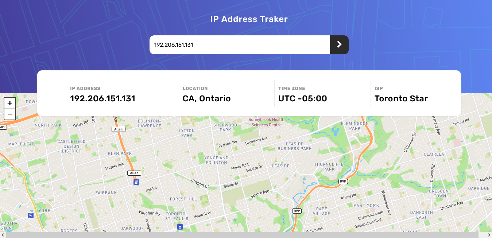
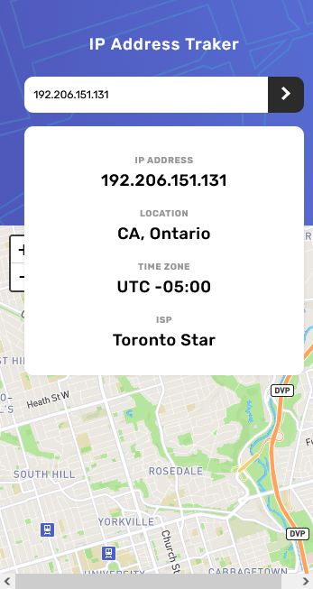

# Frontend Mentor - IP address tracker solution

This is a solution to the [IP address tracker challenge on Frontend Mentor](https://www.frontendmentor.io/challenges/ip-address-tracker-I8-0yYAH0). Frontend Mentor challenges help you improve your coding skills by building realistic projects. 

## Table of contents

- [Overview](#overview)
  - [The challenge](#the-challenge)
  - [Screenshot](#screenshot)
  - [Links](#links)
- [My process](#my-process)
  - [Built with](#built-with)
  - [What I learned](#what-i-learned)
  - [Continued development](#continued-development)
- [Author](#author)
- [Acknowledgments](#acknowledgments)

**Note: Delete this note and update the table of contents based on what sections you keep.**

## Overview

### The challenge

Users should be able to:

- View the optimal layout for each page depending on their device's screen size
- See hover states for all interactive elements on the page
- See their own IP address on the map on the initial page load
- Search for any IP addresses or domains and see the key information and location

### Screenshot

### Links

- Solution URL: https://github.com/chiefcipher/ip-address-tracker
- Live Site URL: https://chiefcipher.github.io/ip-address-tracker/

## My process

### Built with

- Semantic HTML5 markup
- CSS3 and SCSS 
- Flexbox
- Mobile-first workflow

### What I learned

- Making request to apis and getting responses back  
- Destructurinig responses to pickout the needed data  
- Getting response from one api and using it as a parameter to query another api 
- Learnt how to use the both ipify.org and mapbox.com api</h2>

### Continued development
- Looking forward to working with more apis 

## Author

- Website - [Yakubu Samuel ](http://chiefcipher.netlify.app/)
- Frontend Mentor - [@chiefcipher](https://www.frontendmentor.io/profile/chiefcipher)
- Twitter - [@chief_cipher](https://twitter.com/chief_cipher)
- Linkedin  - [Samuel Yakubu](https://www.linkedin.com/in/chiefcipher/)
